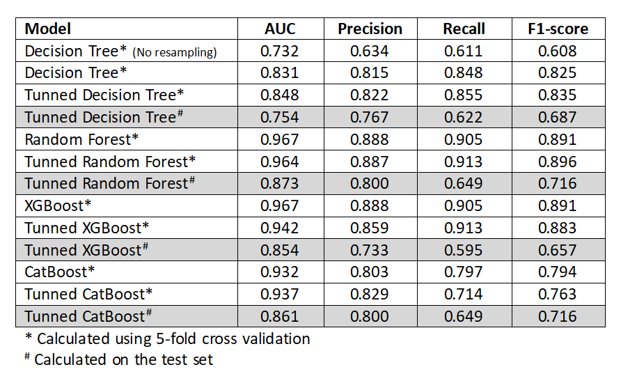
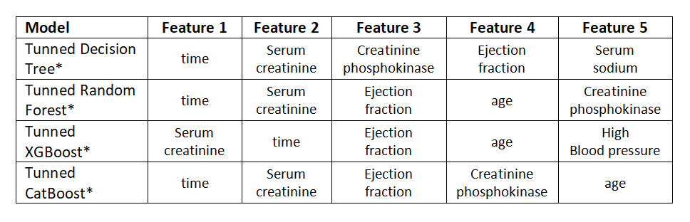

# Heart Failure


## Introduction

Cardiovascular diseases claim approximately 17 million lives globally each year, with heart failure being one of the most prevalent manifestations. Heart failure (HF) occurs when the heart is unable to pump sufficient blood to meet the body's needs. The electronic medical records of patients capture a wealth of information, including symptoms, physical characteristics, and clinical laboratory test results. These records provide an invaluable resource for biostatistical analysis, enabling the identification of patterns and correlations that may not be immediately apparent to medical practitioners.

Machine learning, in particular, offers powerful tools for predicting patient survival based on their medical data and for identifying the most critical features within these records. In this study, we analyze a dataset of 299 heart failure patients collected in 2015. We employ various machine learning classifiers to predict patient survival and to rank the features that correspond to the most significant risk factors. This approach aims to enhance our understanding of heart failure and to provide insights that could inform clinical decision-making and improve patient outcomes.

The dataset, sourced from the [UC Irvine Machine Learning Repository](https://archive.ics.uci.edu/dataset/519/heart+failure+clinical+records) [1], will be rigorously analyzed to identify the features that most significantly influence heart failure outcomes. The findings from this analysis will shed light on the key factors contributing to heart failure, offering valuable insights that could enhance our understanding of the condition and inform more effective prevention and treatment strategies.

In this study, we will employ a range of supervised classification machine learning models, including Decision Tree Classifier, Random Forest Classifier, Gradient Boosting Classifier, and CatBoost Classifier. Our approach will involve systematically searching for the most effective model by optimizing each model's hyperparameters through rigorous experimentation.

We will utilize techniques such as grid search and cross-validation to identify the optimal hyperparameter settings for each model. By evaluating the performance of these models on our dataset, we aim to determine the model that delivers the best predictive accuracy and generalization capability. At the end, the top-performing model will be identified, along with its tuned hyperparameters, which will be recommended for practical implementation in relevant applications.

## Data Preparation

Before feeding the data into our models, it is essential to prepare it in an appropriate format, as the dataset includes both numerical and categorical features. Each type of feature will be processed accordingly to ensure optimal model performance.

1. **Missing Values**: The dataset contains no missing values or duplicates, eliminating the need for imputation or data cleaning in this regard.

2. **Categorical Data**: Categorical features will be one-hot encoded to convert them into a numerical format, ensuring that the models can accurately interpret and leverage these features.

3. **Feature Selection**: All features present in the dataset will be included in our analysis and model training, as each may provide valuable insights for predicting outcomes.

4. **Outlier Detection**: We will use the t-SNE method to evaluate the dataset for potential outliers. After thorough analysis, we observed that the data points are coherent, with no significant outliers detected.

5. **Normalization**: To ensure that all features are on a consistent scale, the dataset will be normalized using the `StandardScaler` before being fed into the models. This step is crucial for achieving more efficient and stable training across the different algorithms.

## Modeling

In this section, we will focus on identifying and developing a model that effectively fits our data and delivers accurate predictions. To evaluate the performance of the models, we will use two key metrics: AUC (Area Under the ROC Curve) and recall, as our primary goal is to identify all potential patients with heart failure.

To optimize each model’s performance, we will employ GridSearchCV to perform an exhaustive search for the best hyperparameters. The selection of optimal hyperparameters will be guided primarily by the recall score, ensuring that our model maximizes the detection of heart failure cases. Once the optimal hyperparameters are identified, we will calculate and report the performance metrics for each model on the test set, providing a comprehensive comparison of their predictive accuracy and overall effectiveness.

The results of this analysis, including all the corresponding performance metrics, are summarized in the following table:



Additionally, the table below reports the top five most important features identified by each classifier. These features are ranked based on their contribution to the model's predictive accuracy, offering valuable insights into the key factors influencing heart failure classification.



As shown in the table above, the follow-up time, serum creatinine levels, and ejection fraction are identified as the three most critical factors in classifying patients with heart failure. These variables play a significant role in predicting patient outcomes and are key indicators of heart failure severity.

## Final model

The Tuned Random Forest Regressor model demonstrated the highest performance among all classifiers, achieving a maximum recall value of 0.649 and an AUC of 0.873. The Tuned CatBoost model and Tuned Decision Tree followed closely in second and third place, with recall values of 0.649 and 0.622, respectively. These results highlight the effectiveness of the Random Forest model in accurately identifying potential heart failure cases, while the CatBoost and Decision Tree models also performed strongly, further validating their utility in this predictive task.

## Final remarks

It is important to recognize that the results obtained in this study are not definitive. Different methodologies, hyperparameter tuning strategies, or alternative performance metrics could yield varying outcomes. Therefore, the findings presented here should be considered relative rather than absolute, as they are contingent upon the specific methodologies and data used in this analysis.

To further enhance the accuracy and reliability of the model, we recommend expanding the dataset to include a larger number of data points. A more comprehensive dataset would likely improve the model's generalizability, making the results more robust and applicable to a broader range of patients with diverse conditions. This expansion would also help in reducing potential biases and provide a stronger foundation for future research and practical applications.

## References

[1] Heart Failure Clinical Records. (2020). UCI Machine Learning Repository. https://doi.org/10.24432/C5Z89R.

## Repository Structure

```
├── Data: Data used for modeling 
├── Images: All the images including the one for README file
├── Notebook: Main notebook
├── PDF: PDF file of the notebook
├── README.md: Project information and repository structure
```


